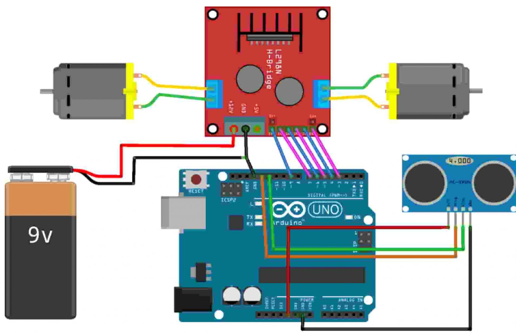
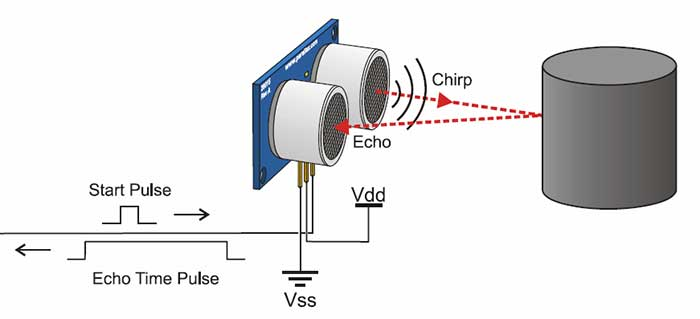
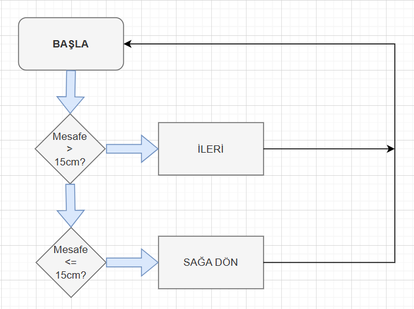

[](https://github.com/sevginuroksuz/aurdunio-smart-car)
[](LICENSE)
# Arduino ile Engelden Kaçan Robot Araba
> HC‑SR04 sensör ve L298N sürücü ile otonom engelden kaçış mekanizması.

---
## 📋 İçindekiler
1. [Proje Tanımı](#proje-tanımı)
2. [Malzemeler](#malzemeler)
3. [Devre Şeması](#devre-şeması)
4. [Çalışma Prensibi](#çalışma-prensibi)
5. [Fotoğraflar](#fotoğraflar)
6. [Kod & Algoritma](#kod--algoritma)
7. [Kurulum](#kurulum)
8. [Sonuçlar](#sonuçlar)
9. [Gelecek Çalışmalar](#gelecek-çalışmalar)
10. [Kaynaklar](#kaynaklar)
---

## 1. Proje Tanımı

Bu proje, Arduino Uno kontrolünde HC-SR04 ultrasonik sensör ile uzaklık ölçen ve L298N motor sürücü kartı üzerinden DC motorları yöneterek engelden kaçan bir robot araba tasarımını içerir. Klemens (terminal block) ile sensör ve motor bağlantıları daha sağlam ve düzenli yapılmıştır.  Eklenecek olan bir anahtar (switch) ile motor beslemesi sağlıklı bir şelikde açılıp kapatılabilecektir.
---

## 2. Gerekli Malzemeler

- **Arduino Uno**  
- **Çok Amaçlı Robot Platformu** (şasi ve tekerlek kitleri)  
- **L298N Voltaj Regülatörlü Çift Motor Sürücü Kartı**  
- **HC-SR04 Ultrasonik Mesafe Sensörü**  
- **6×AA Pil Yuvası** (veya Li-Po pil)  
- **Jumper Kabloları**  
- **Klemens (Terminal Block)** (sensör ve motor kabloları için)  
- **Anahtar (Switch)** (motor beslemesini açıp kapatmak için) 

---

## 3. Devre Şeması ve Bağlantılar

> **Not:** Switch ve klemensi, kırmızı ile gösterilen güç hattına ekleyin.

1. **HC-SR04 Sensör**  
   - Trig → Arduino D13  
   - Echo → Arduino D12  
2. **L298N Motor Sürücü**  
   - IN1 → D7, IN2 → D6, ENA (PWM) → D9  
   - IN3 → D5, IN4 → D4, ENB (PWM) → D3  
   - Motor çıkışları → sağ ve sol DC motorlar  
3. **Güç ve Kontrol**  
   - 6×AA pil yuvası (veya Li-Po) → L298N 12 V giriş  
   - **Switch** seri olarak L298N güç hattına eklenerek motor beslemesi açılıp kapatılır  
   - **Klemens** ile sensör ve motor besleme kabloları güvenli şekilde sabitlenir 
---

## 4. Ultrasonik Sensörün Çalışma Prensibi

- `Trig` pini 10 µs süreyle HIGH yapılarak ultrasonik dalga gönderilir.  
- `Echo` pini `pulseIn()` ile yüksek kalma süresi ölçülür.  
- Mesafe (cm) = (süre / 2) / 29.1 formülüyle hesaplanır.
- Karar:
   - `< 15 cm` → geri + sağa dönüş
   - `>= 15 cm` → ileri hareket edilir.

---
## 📷 Fotoğraflar
| Ön Görünüm                                     | Yan Görünüm                                  |
|:----------------------------------------------:|:--------------------------------------------:|
|                        |    
|                       |                       |
|

---
## 5. Yazılım Algoritması

1. Trig pini LOW → kısa bekleme  
2. Trig pini HIGH (10 µs) → LOW  
3. `pulseIn(echoPin, HIGH)` ile süre ölçümü  
4. `uzaklik < 15 cm` ise:  
   - `geri()` → 150 ms  
   - `sag()`  → 250 ms  
5. Aksi halde `ileri()`

---

## 6. Arduino Kod Örneği

```cpp
#define echoPin 12
#define trigPin 13
#define MotorR1 7
#define MotorR2 6
#define MotorRE 9
#define MotorL1 5
#define MotorL2 4
#define MotorLE 3

long sure, uzaklik;

void setup() {
  pinMode(echoPin, INPUT);
  pinMode(trigPin, OUTPUT);
  pinMode(MotorL1, OUTPUT);
  pinMode(MotorL2, OUTPUT);
  pinMode(MotorLE, OUTPUT);
  pinMode(MotorR1, OUTPUT);
  pinMode(MotorR2, OUTPUT);
  pinMode(MotorRE, OUTPUT);
  Serial.begin(9600);
}

void loop() {
  digitalWrite(trigPin, LOW);
  delayMicroseconds(5);
  digitalWrite(trigPin, HIGH);
  delayMicroseconds(10);
  digitalWrite(trigPin, LOW);
  
  sure = pulseIn(echoPin, HIGH);
  uzaklik = sure / 29.1 / 2;
  Serial.println(uzaklik);

  if (uzaklik < 15) {
    geri();
    delay(150);
    sag();
    delay(250);
  } else {
    ileri();
  }
}

void ileri() {
  digitalWrite(MotorR1, HIGH);
  digitalWrite(MotorR2, LOW);
  analogWrite(MotorRE, 150);
  digitalWrite(MotorL1, HIGH);
  digitalWrite(MotorL2, LOW);
  analogWrite(MotorLE, 150);
}

void sag() {
  digitalWrite(MotorR1, HIGH);
  digitalWrite(MotorR2, LOW);
  analogWrite(MotorRE, 0);
  digitalWrite(MotorL1, HIGH);
  digitalWrite(MotorL2, LOW);
  analogWrite(MotorLE, 150);
}

void geri() {
  digitalWrite(MotorR1, LOW);
  digitalWrite(MotorR2, HIGH);
  analogWrite(MotorRE, 150);
  digitalWrite(MotorL1, LOW);
  digitalWrite(MotorL2, HIGH);
  analogWrite(MotorLE, 150);
}
```
---

## 7. Kurulum 🛠️

1. Arduino IDE ile **Arduino Uno**’yu seçin ve uygun seri portu ayarlayın.  
2. Devreyi aşağıdaki gibi klemens kullanarak kurun:  
   - **🔩 Klemens**: Pil bağlantı kanloları ve L298N motor sürücü besleme kablolarını sabitlemek için.   
3. Arduino kodunu yükleyin.  
4. Seri Monitörü **9600 bps**’de açın.  
5. Pillerin hepsini pil yuvasına takın böylece robot çalışıyor halde olacaktır.
6. 
---

## 8. Sonuçlar ✅

- **📏 Mesafe Ölçümü**: 10–80 cm aralığında ±2 cm hassasiyet elde edildi.  
- **🤖 Engelden Kaçış**: Engel algılandığında araç geri gidip 90° dönüş yaparak yeni rota sürdürdü.  


---

## 9. Gelecek Çalışmalar 🚀

- **🔧 Switch Entegrasyonu**: Daha ergonomik bir açma/kapama arayüzü için ekstra switch düzenlemeleri.  
- **📝 Kod Düzenleme**: Okunabilirliği artırmak ve bakımını kolaylaştırmak için refaktör.  
- **🔋 Pil Verimliliği**: Pillerin ömrünü uzatmak için güç yönetimi ve düşük güç modları denenecek.  
- **📊 Son Testler & Performans Raporu**: Tüm sistemi kapsayan kapsamlı testler yapılıp ayrıntılı performans raporu hazırlanacak.

---

## 10. Kaynaklar 📚

1. Maker Robotistan, Arduino ile Engelden Kaçan Robot Araba Yapımı : https://maker.robotistan.com/engelden-kacan-robot-yapimi/  
2. GitHub – Arduino Smart Car Projesi: https://github.com/sevginuroksuz/aurdunio-smart-car
3. Ultrasonik Sensörün Çalışma Prensibi: https://www.bjultrasonic.com/tr/how-do-ultrasonic-sensors-work/
4. Yazılım Algoritması Çiziminde: drawio'dan yararlanıldı.

