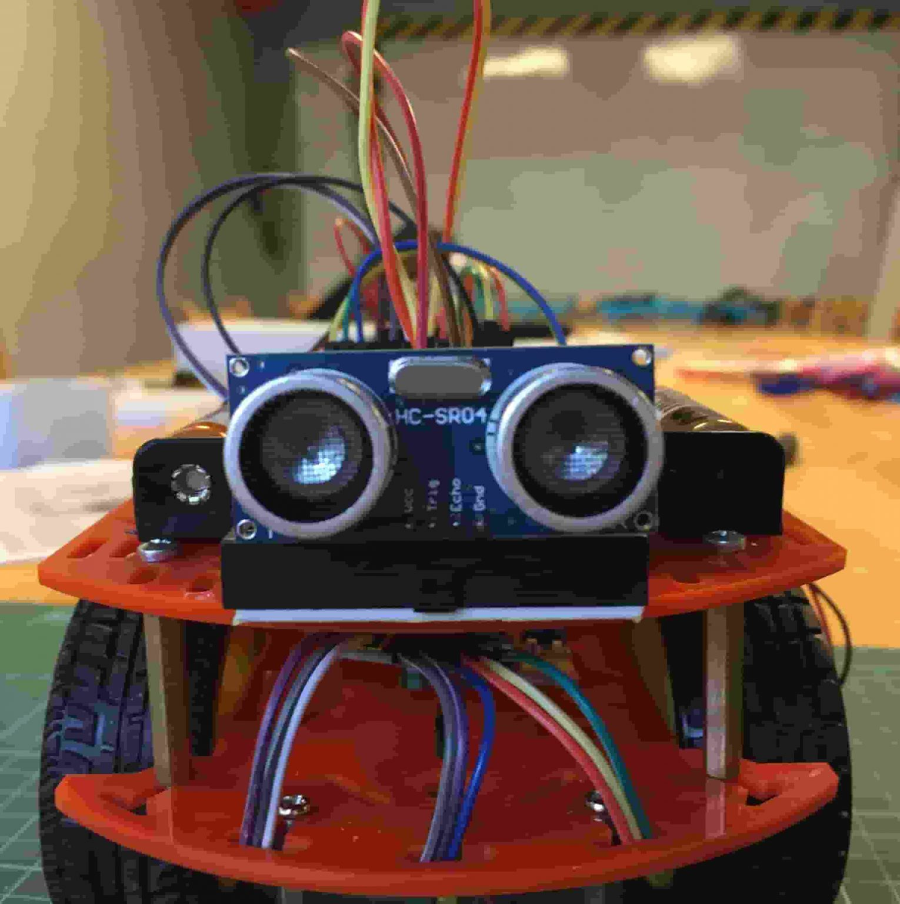

# Arduino Smart Car

## 📌 Proje Konusu

Arduino Smart Car, **otonom hareket edebilen** ve **karşısına çıkan engelleri algılayarak yön değiştiren** bir robot projesidir. Bu proje sayesinde **temel robotik, elektronik ve programlama becerileri** geliştirilecek ve IoT uygulaması yapılmış olacaktır.

## 📋 Proje Kısa Özeti

Bu proje, Arduino platformu ve sensörler kullanarak otonom hareket edebilen bir robot tasarlamayı hedeflemektedir. Robot, çevresindeki engelleri algılar ve bu engellere göre yön değiştirerek belirlenen rotada ilerler. Proje, robotik sistemler, elektronik ve yazılım geliştirme becerilerini geliştirmeyi amaçlamaktadır.

## ⚙️ Proje Gereksinimleri

Projenin çalışabilmesi için aşağıdaki donanım ve yazılım gereksinimlerine sahip olmanız gerekmektedir:

### Donanım Gereksinimleri:
- Arduino Uno
- L298N Motor Sürücü Kartı
- HC-SR04 Ultrasonik Sensör
- DC Motorlar ve Tekerlekler
- 6'lı AA Pil Yuvası & Li-Po Pil
- Jumper Kablolar
- LED ve Buzzer (Opsiyonel)

### Yazılım Gereksinimleri:
- Arduino IDE
- C++ programlama bilgisi

## 🚀 Projeyi Çalıştırma

### Adım 1: Donanımı Bağlayın
- Arduino Uno'yu bilgisayarınıza bağlayın.
- L298N motor sürücü kartını Arduino'ya bağlayın.
- HC-SR04 sensörü ve motorları uygun şekilde bağlayın.

### Adım 2: Yazılımı Yükleyin
- Arduino IDE'yi açın.
- `Arduino Smart Car` yazılımını buraya yapıştırın ve Arduino'ya yükleyin.
- Arduino'ya yükledikten sonra projeyi çalıştırın.

## 🏷️ Proje Lisans Bilgileri

Bu proje **MIT Lisansı** ile lisanslanmıştır.

## 🔑 Proje Anahtar Kelimeleri
- Arduino
- Robotik
- Otonom Araç
- Engel Algılama
- IoT

## 📸 Görseller

Robotun son halini gösteren bir görsel:

